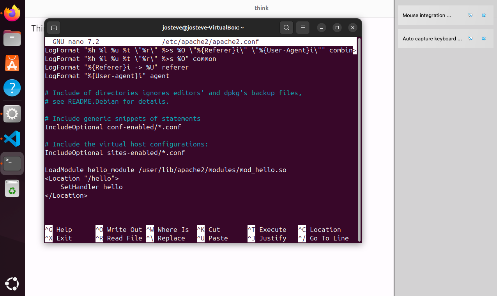

# Q2

## Setup
### Q2: Setting Up a Development Environment in VirtualBox

For the development and testing of the Apache module and the corresponding C++ library, I utilized Oracle VM VirtualBox.

#### Download and Installation
I started by downloading and installing VirtualBox from the [official Oracle website](https://www.virtualbox.org/). 

#### Creating a New Virtual Machine
Once VirtualBox was installed, I proceeded to set up a new virtual machine (VM) to run Ubuntu Linux, which would serve as the development and testing platform for the project.

- **Name and Operating System**:
  - I named the virtual machine "Development" to clearly indicate its purpose.
  - For the operating system, I chose Linux and specified Ubuntu (64-bit) as the version, corresponding to the ISO image I planned to use.

- **ISO Image**:
  - I downloaded the Ubuntu 24.04 LTS desktop image (`.iso` file) from the [Ubuntu website](https://ubuntu.com/download/desktop) and selected it in VirtualBox as the boot image for the VM.
  
#### Configuration Process
Using the VirtualBox GUI, I configured the virtual machine with the following specifications:
- **Memory and Storage**: Allocated adequate RAM and a virtual hard disk space to ensure smooth operation of the operating system and applications.
- **Network Settings**: Configured network settings to use NAT for easy internet access, which is crucial for updates and installing additional software.
- **Installation**: Followed prompts upon the first boot from the ISO, which included setting up Ubuntu with a user account, timezone, and other initial settings.


## Solution

### 1. C++ Code Explanation (`hello.cpp`)

#### Code
```cpp
extern "C" const char* helloWorld() {
    return "<html><p>Hello World!</p></html>";
}
```

#### Details
- **`extern "C"`**: This is used here to disable C++ name mangling for the enclosed function. It ensures that the `helloWorld()` function can be linked from C code without issues related to C++'s name mangling, which can prevent linkage due to different function signature representations in C and C++.
- **`const char* helloWorld()`**: Defines a function returning a constant character pointer. It returns a hardcoded HTML string. This function is simple and stateless, returning a pointer to a literal, which avoids issues with dynamic memory allocation and is safe to call across language boundaries (like from C-based Apache modules).

### 2. Compiling `hello.cpp` to `libhello.so`

#### Command
```bash
g++ -fPIC -shared -o libhello.so hello.cpp
```

#### Details
- **`g++`**: The GNU C++ Compiler, used for compiling C++ code.
- **`-fPIC`**: Stands for "Position Independent Code," a requirement for shared libraries to ensure they work regardless of where they are loaded into memory.
- **`-shared`**: Tells the compiler to produce a shared library rather than an executable binary.
- **`-o libhello.so`**: Specifies the output filename for the compiled library, `libhello.so`.

### 3. Moving `libhello.so` to a Standard Library Directory

#### Command
```bash
sudo mv libhello.so /usr/local/lib/
sudo ldconfig
```

#### Details
- **Moving the Library**: Moves `libhello.so` from the current directory to `/usr/local/lib/`, a common directory for shared libraries on UNIX-like systems, which is typically included in the system's library path.
- **`sudo ldconfig`**: Updates the system's dynamic linker cache to ensure it recognizes the new library location without requiring a reboot or reconfiguration.

### 4. Recompiling and Linking `mod_hello.c` with `apxs`

#### Code for `mod_hello.c`
```c
#include "httpd.h"
#include "http_protocol.h"
#include "ap_config.h"

extern const char* helloWorld();

static int hello_handler(request_rec *r) {
    if (!r->handler || strcmp(r->handler, "hello") != 0) {
        return DECLINED;
    }

    ap_set_content_type(r, "text/html;charset=ascii");
    ap_rputs(helloWorld(), r);
    return OK;
}

static void register_hooks(apr_pool_t *p) {
    ap_hook_handler(hello_handler, NULL, NULL, APR_HOOK_MIDDLE);
}

module AP_MODULE_DECLARE_DATA hello_module = {
    STANDARD20_MODULE_STUFF,
    NULL,
    NULL,
    NULL,
    NULL,
    NULL,
    register_hooks
};
```

#### Command
```bash
sudo apxs -c -i -a -L/usr/local/lib -lhello mod_hello.c
```

#### Details
- **`mod_hello.c` Code Explanation**: Defines a simple Apache module that registers a handler `hello_handler` which outputs HTML. It checks if the request is meant for it by examining the `handler` name.
- **`sudo apxs -c -i -a -L/usr/local/lib -lhello`**: Compiles the module, installs it into Apache's modules directory, activates it by adding a `LoadModule` directive automatically, and links against `libhello.so`.

### 5. Editing Apache Configuration

#### Details
- **Config File**: I opened `/etc/apache2/apache2.conf` and ensure the following lines are present:
  ```apache
  LoadModule hello_module /usr/lib/apache2/modules/mod_hello.so
  <Location "/hello">
      SetHandler hello
  </Location>
  ```
- **Purpose**: `LoadModule` directive activates the module in the Apache server. The `<Location>` directive maps a URL path to to handler, setting it up to respond when the specific path is requested.




### 6. Testing with Curl

#### Command
```bash
curl http://localhost/hello
```


### 7. Flutter app integration

After setting up the Apache module to handle web requests by responding with a simple "Hello World!" HTML, I incorporated a Flutter application to interact with this server. Here's an overview of the Flutter app's functionality and how it connects to the Apache module.

#### Development and Testing on Linux

I installed Flutter on my Linux machine to develop and test this application. Running the app in a Linux environment allows it to interact seamlessly with the locally hosted Apache server. I configured Flutter for Linux following the standard installation and setup process, ensuring that the development environment was prepared to build and run Linux desktop applications. Found from [Flutter Linux installation guide](https://docs.flutter.dev/get-started/install/linux).


#### Flutter Application Overview

The Flutter app is designed to fetch data from the Apache server using the HTTP protocol. It sends a request to `http://localhost/hello`, where the Apache module is configured to respond. This is accomplished through the use of Dart's `http` package, which facilitates HTTP requests. TODO: INCLUDE LINK OF THE FLUTTER APP SCREENSHOT!

#### App Structure and Code Explanation

1. **Main Entry Point**: The app starts by running `MyApp`, a basic Flutter widget.
   ```dart
   void main() {
     runApp(const MyApp());
   }
   ```

2. **MyApp Widget**: This is a stateless widget that defines the overall theme of the app and sets `HomePage` as the home screen.
   ```dart
   class MyApp extends StatelessWidget {
     const MyApp({super.key});

     @override
     Widget build(BuildContext context) {
       return MaterialApp(
         title: 'Flutter Demo',
         debugShowCheckedModeBanner: false,
         theme: ThemeData(
           colorScheme: ColorScheme.fromSeed(seedColor: Colors.deepPurple),
           useMaterial3: true,
         ),
         home: const HomePage(),
       );
     }
   }
   ```

3. **HomePage Widget**: Displays the main UI, featuring an `AppBar` and a `FutureBuilder` for asynchronous HTTP requests.
   ```dart
   class HomePage extends StatelessWidget {
     const HomePage({super.key});

     @override
     Widget build(BuildContext context) {
       return Scaffold(
         appBar: AppBar(title: const Text("Thinkwider!")),
         body: Center(
           child: FutureBuilder(
             future: http.get(Uri.parse('http://localhost/hello')),
             builder: (context, snapshot) {
               if (snapshot.connectionState == ConnectionState.done) {
                 return Text(snapshot.data?.body ?? 'Error');
               } else {
                 return const CircularProgressIndicator();
               }
             },
           ),
         ),
       );
     }
   }
   ```

   - **FutureBuilder**: Manages the state of the HTTP request. It initiates the request to `http://localhost/hello` when the widget is built and listens for the response. Once the request completes, it checks the connection state. If the request is done, it either displays the response body or shows an error message if no response was received.

  


## Problems faced

1. **Compiling and Linking Issues**:
   - **Problem**: Initially, the `hello.cpp` file was compiled into `hello.so`, but Apache modules typically expect libraries to follow the naming convention of `lib<name>.so`.
   - **Solution**: Renamed `hello.so` to `libhello.so` to adhere to standard naming conventions. Adjusted the `apxs` command to correctly link against `libhello.so` using `-lhello`.

2. **Apache Module Loading Error**:
   - **Problem**: After compiling the Apache module (`mod_hello.so`) and attempting to load it, Apache reported errors stating it could not find `libhello.so`. This error occurred because `libhello.so` was located in a non-standard directory (`/home/josteve`).
  
   - **Solution**: Moved `libhello.so` to `/usr/local/lib`, a standard library directory that Apache and other system processes commonly check. Updated the library cache using `sudo ldconfig` to ensure the system recognizes the new library location.

3. **Segmentation Faults During Request Handling**:
   - **Problem**: Encountered segmentation faults (`segfaults`) when handling requests, which suggested memory access violations within the Apache process. This was a critical issue as it caused Apache to crash, resulting in "Empty reply from server" errors.
   - **Solution**:
     - **Code Verification**: Reviewed and simplified the `helloWorld()` function in `hello.cpp` to return a constant string, ensuring there were no dynamic memory management issues.
     - **Apache Module Review**: Ensured that the `hello_handler` function in `mod_hello.c` did not perform unsafe operations. Simplified the handler logic and checked for any potential pointer mismanagement.
    
     - **Recompilation and Debugging**: Recompiled the module and enabled core dumps to capture detailed crash information. Analyzed the dumps using `gdb` to identify the exact location of segfaults.
     - **Configuration Testing**: Regularly used `sudo apachectl configtest` to verify Apache configurations after adjustments, ensuring no syntax errors were present.


5. **Testing and Validation Failures**:
   - **Problem**: Initial attempts to test the module functionality using `curl` and direct browser access were unsuccessful, yielding server errors and no valid responses.
   - **Solution**: Conducted a thorough review of Apache logs (`/var/log/apache2/error.log`) to identify configuration errors and missing file issues. Resolved these issues by ensuring that the Apache configuration file had the correct `LoadModule` directive and that the server environment was properly configured to include the library path.

6. **Final Configuration and System Restart**:
   - **Solution**: After addressing the aforementioned issues, restarted Apache to apply changes using `sudo systemctl restart apache2`. Confirmed that Apache started without errors and tested the module response successfully using `curl http://localhost/hello`. The correct "Hello World!" response was confirmed, indicating that the module and library were functioning as expected.
